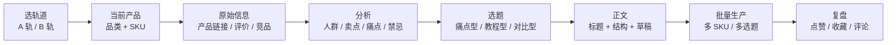

# 小红书AI内容工作流-从零打通版

> 这篇是给“我看了很多文件，但不知道应该先做什么”的人准备的。

## 先说结论

学员包 2 不是一份普通讲义，它本质上是一个内容生产工厂。

它把一件事拆成了 6 个阶段：

1. 选轨道和准备环境
2. 选一个当前产品
3. 收集原始信息
4. 分析产品和用户
5. 策划选题
6. 写正文、批量生产、复盘

你不需要一次学完所有文件。零基础最稳的做法，是先只跑通一个 SKU，再把每一步变成可复用的 `Skill` 或“子技能”。

如果你要对照原始学员包，记住这套材料的真实根目录是 `/Users/a2618/Documents/小红书AI内容工作流-学员包 2`。课程说明在 `课程文件/课前技术准备课.md`，真正的工作流文件都在 `学员工作文件夹/` 下面。

## 这套系统里，Skill 到底是什么

这里要分清两个概念：

- 学员包里的“子技能”，是课程内部已经拆好的流程模块，比如 `投喂`、`分析`、`选题策划`、`笔记撰写`
- Claude Code 里的 `Skill`，是把重复流程封装成可复用能力的方式

你可以把它们理解成一件事的两个层级：

- 学员包里的子技能 = 课程里已经预设好的执行步骤
- Claude Code 的 Skill = 你自己把这些步骤再封装一层，变成更稳定的工作流工具

## 先看流程图



## 从零开始的正确顺序

### 第 1 步：先选轨道

学员包 2 允许两种方式：

- A 轨：Cowork 桌面版
- B 轨：Claude Code / Codex / Trae / Cursor

如果你只是想先看懂流程，先别急着配置工具，先把“内容生产链路”看明白。

如果你已经在用 Claude Code，B 轨更适合你，因为你可以把每一步都写成可复用的 `Skill`。

### 第 2 步：只选一个品类和一个 SKU

不要同时学很多产品。

最稳的起点是：

- 品类：`遮瑕膏测评`
- SKU：`玛露遮瑕膏`

这样做的原因很简单：

- 资料已经完整
- 评价已经很多
- 痛点很清楚
- 适合练“从信息到内容”的完整闭环

### 第 3 步：先把当前产品填好

学员包里真正的路由中心是 `07-系统维护/当前产品.md`。

你可以把它理解成“现在到底处理哪个产品”的开关。

第一次起步时，你只需要确保这三项清楚：

- 当前品类
- 品类关键词
- 当前 SKU

如果这一步没做好，后面的投喂、分析、选题都会跑偏。

### 第 4 步：先做投喂，再做分析

这套系统最容易被误解的地方，就是很多人会直接让 AI 写文案。

正确顺序不是“先写”，而是：

1. 先把原始信息整理出来
2. 再让 AI 分析
3. 再策划选题
4. 最后才写正文

### 第 5 步：先做一个最小闭环

第一次不要追求全量。

最小闭环只要四样东西：

- 1 份原始信息
- 1 份分析报告
- 3 条选题
- 1 篇正文草稿

只要你能把这 4 步跑完，你就已经真正学会了这套工作流。

## 每个文件到底干什么

| 文件 / 目录 | 作用 | 你在这里放什么 |
| --- | --- | --- |
| `源根目录/CLAUDE.md` | 总说明 | 课程总规则、路径、口径 |
| `学员工作文件夹/07-系统维护/当前产品.md` | 当前路由 | 现在处理哪个品类和 SKU |
| `学员工作文件夹/07-系统维护/产品注册表.md` | 产品清单 | 所有品类和 SKU 的登记 |
| `学员工作文件夹/01-产品库/[SKU]/_原始信息/原始信息.md` | 原材料输入 | 链接、评价、直播话术、竞品信息 |
| `学员工作文件夹/01-产品库/[SKU]/_分析报告/` | 分析输出 | 人群画像、卖点、痛点、禁忌 |
| `学员工作文件夹/02-爆款素材库/[品类]/` | 爆款素材 | 竞品爆款和内容参考 |
| `学员工作文件夹/03-选题池/[品类]/` | 选题池 | 待审核和裂变选题 |
| `学员工作文件夹/05-内容工厂/[SKU]/` | 正文工厂 | 草稿、待审稿、批量稿 |
| `学员工作文件夹/06-账号管理/` | 复盘记录 | 发布数据和运营日志 |
| `学员工作文件夹/07-系统维护/子技能/` | 流程模块 | 每一步的“固定做法” |

## Skill 在工作流里怎么用

你可以把 Skill 当成“每个阶段的标准动作包”。

### 阶段 1：投喂 Skill

作用：

- 读取产品信息
- 整理原始素材
- 写入 `学员工作文件夹/01-产品库/[SKU]/_原始信息/原始信息.md`

你可以这样说：

```text
帮我投喂玛露遮瑕膏。
我已经有产品链接、评价和竞品信息了，请整理成原始信息文件。
```

### 阶段 2：分析 Skill

作用：

- 从原始信息里提炼卖点
- 总结用户痛点
- 输出分析报告到 `学员工作文件夹/01-产品库/[SKU]/_分析报告/`

你可以这样说：

```text
帮我分析玛露遮瑕膏。
请输出目标人群、核心卖点、差评风险和内容禁忌。
```

### 阶段 3：采集 Skill

作用：

- 收集同品类爆款
- 记录标题、点赞、结构、素材风格到 `学员工作文件夹/02-爆款素材库/[品类]/`

你可以这样说：

```text
帮我采集遮瑕膏测评的爆款素材，优先找黑眼圈、痘印、教程类内容。
```

### 阶段 4：选题 Skill

作用：

- 基于分析报告和素材库生成选题
- 输出可审核的标题和结构到 `学员工作文件夹/03-选题池/[品类]/`

你可以这样说：

```text
给遮瑕膏测评策划 10 条选题，覆盖痛点解决、教程、对比测评和品质解释。
```

### 阶段 5：写稿 Skill

作用：

- 把某条选题扩成正文
- 保持账号人设和内容结构一致
- 写入 `学员工作文件夹/05-内容工厂/[SKU]/`

你可以这样说：

```text
用第 3 条选题写正文，要求 300-500 字，开头先写场景，不要直接报产品名。
```

### 阶段 6：生产 Skill

作用：

- 批量出稿
- 多 SKU 同步生成

你可以这样说：

```text
给遮瑕膏测评这个品类的所有 SKU 各出 1 条正文草稿。
```

## 在 Claude Code 里，Skill 的最佳用法

Skill 最适合做两类事：

1. 重复出现的阶段动作
2. 需要固定输出格式的任务

在学员包 2 里，这两个条件都满足。

所以最自然的做法是：

- 你先用自然语言把阶段讲清楚
- 再让 Claude 按对应的 Skill 或子技能执行
- 如果这一步总是重复，就把它固化成 Skill

## 一个最小可执行路径

如果你今天只想跑通一次，按这个顺序来：

1. 打开 `/Users/a2618/Documents/小红书AI内容工作流-学员包 2/课程文件/课前技术准备课.md`
2. 选定一个轨道
3. 在 `当前产品.md` 里确认品类和 SKU
4. 运行投喂，把原始信息补齐
5. 运行分析，得到分析报告
6. 运行选题策划，拿到 3 到 10 条选题
7. 运行笔记撰写，产出 1 篇正文
8. 复盘数据，把结果写回选题池

这就是一个完整闭环。

## 你最容易卡住的地方

### 1. 一上来就想写正文

不要。

先做投喂和分析，不然正文没有依据。

### 2. 以为 Skill 是“更高级的按钮”

不是。

Skill 的价值是把重复流程标准化，不是增加神秘感。

### 3. 不区分“当前产品”和“选题池”

- 当前产品负责具体 SKU
- 选题池负责品类级内容方向

这两个层级不能混。

### 4. 把“子技能”当成一个人

它不是人，是流程模块。

你要找的是“这一步该用哪个模块”，不是“问谁都行”。

## 如果你只记住一句话

先选一个产品，先投喂，再分析，再选题，最后写稿。

Skill 的作用，就是把这四步里每一步都变成可重复的固定动作。

## 下一步

- 想看最小执行手册：[`小红书AI内容工作流-小白一步一步使用指南`](./小红书AI内容工作流-小白一步一步使用指南.md)
- 想先学怎么用现成 Skill：[`Claude Code 技能使用速查`](./Claude%20Code%20技能使用速查.md)
- 想看单品案例怎么落地：[`小红书AI内容工作流-遮瑕膏测评-新手实战版`](./小红书AI内容工作流-遮瑕膏测评-新手实战版.md)
- 想对照课程原始材料：源文件在 `/Users/a2618/Documents/小红书AI内容工作流-学员包 2`
