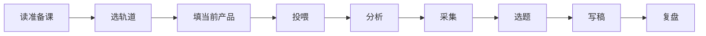

# 小红书AI内容工作流-小白一步一步使用指南

> 这篇只回答一件事：你拿到学员包 2 之后，第一步、第二步、第三步到底做什么。

## 先记住一句话

学员包 2 的正确用法，不是把所有文件一次看完，而是按顺序跑通一条链路：

**读准备课 -> 选轨道 -> 填当前产品 -> 投喂 -> 分析 -> 采集 -> 选题 -> 写稿 -> 复盘**

如果你今天只想先跑通一次，就先跟着下面这份最短路径做。

## 这份手册适合谁

- 你刚拿到学员包 2，完全不知道先点哪个文件
- 你听过“投喂、分析、选题、写稿”，但不知道顺序
- 你想知道 Skill 怎么插进工作流
- 你只想先跑通一个产品，不想一上来学全部目录

## 你先准备什么

先记住两个目录：

- 原始资料根目录：`/Users/a2618/Documents/小红书AI内容工作流-学员包 2`
- 真正要操作的工作文件夹：`学员工作文件夹/`

如果你是新手，先不要同时碰多个产品。直接用这个例子练习：

- 品类：`遮瑕膏测评`
- SKU：`玛露遮瑕膏`

## 流程图



## 一步一步照着做

### 第 1 步：先读准备课

打开：

- `/Users/a2618/Documents/小红书AI内容工作流-学员包 2/课程文件/课前技术准备课.md`

你先看这 3 件事：

- 你走 A 轨还是 B 轨
- 你的环境有没有装好
- 你的工作文件夹有没有准备好

如果你已经能正常使用 Claude Code，就把重点放在 B 轨理解上。

### 第 2 步：再看 `CLAUDE.md`

打开根目录的 `CLAUDE.md`，它告诉你整套工作流怎么分层：

- `01-产品库/`：放产品信息和分析
- `02-爆款素材库/`：放爆款参考
- `03-选题池/`：放选题
- `05-内容工厂/`：放正文
- `06-账号管理/`：放复盘数据
- `07-系统维护/`：放路由和子技能

你不用现在就记住全部，只要先知道：

- `当前产品.md` 决定你正在处理哪个产品
- `子技能/` 决定你这一步该怎么做

### 第 3 步：先只选一个品类和一个 SKU

不要同时学很多产品。

最稳的起点就是：

- 品类：`遮瑕膏测评`
- SKU：`玛露遮瑕膏`

这样做的原因很简单：

- 资料比较完整
- 评价比较多
- 痛点比较清楚
- 适合练“从信息到内容”的完整闭环

### 第 4 步：把“当前产品”填好

打开：

- `学员工作文件夹/07-系统维护/当前产品.md`

你要填的就是 3 个东西：

- 当前品类
- 品类关键词
- 当前 SKU

这一步的作用只有一个：让后面的投喂、分析、选题、写稿都知道写到哪里。

如果这一步不填，后面就容易乱。

### 第 5 步：先做投喂

打开：

- `学员工作文件夹/07-系统维护/子技能/投喂.md`

你先准备这些材料：

- 产品链接
- 真实评价
- 竞品信息
- 直播话术或卖点描述

你可以直接这样对 Claude 说：

```text
帮我投喂玛露遮瑕膏。
我已经有产品链接、真实评价和竞品信息了，请整理成原始信息文件。
```

这一步的产出应该写到：

- `学员工作文件夹/01-产品库/玛露遮瑕膏/_原始信息/原始信息.md`

### 第 6 步：再做分析

打开：

- `学员工作文件夹/07-系统维护/子技能/分析.md`

你要让 Claude 帮你看清 4 件事：

- 目标人群是谁
- 核心卖点是什么
- 差评风险在哪里
- 哪些表达不能乱写

你可以直接这样说：

```text
帮我分析玛露遮瑕膏。
请输出目标人群、核心卖点、差评风险和内容禁忌。
```

这一步的产出应该写到：

- `学员工作文件夹/01-产品库/玛露遮瑕膏/_分析报告/`

### 第 7 步：再去采集爆款素材

打开：

- `学员工作文件夹/07-系统维护/子技能/采集.md`
- `学员工作文件夹/07-系统维护/子技能/爆款监控.md`

你要收集的是同品类里已经验证过的内容，而不是随便找几篇文章。

你可以直接这样说：

```text
帮我采集遮瑕膏测评的爆款素材，优先找黑眼圈、痘印、教程类内容。
```

这一步的产出应该写到：

- `学员工作文件夹/02-爆款素材库/遮瑕膏测评/`

### 第 8 步：用分析和素材去做选题

打开：

- `学员工作文件夹/07-系统维护/子技能/选题策划.md`
- `学员工作文件夹/03-选题池/选题格式说明.md`

你要做的是把“产品分析”和“爆款素材”变成可以写的标题。

你可以直接这样说：

```text
给遮瑕膏测评策划 10 条选题，
覆盖痛点解决、教程、对比测评和品质解释。
```

这一步的产出应该写到：

- `学员工作文件夹/03-选题池/遮瑕膏测评/待审核/`

### 第 9 步：用一条选题写正文

打开：

- `学员工作文件夹/07-系统维护/子技能/笔记撰写.md`

你先不要追求很多篇，先写 1 篇。

你可以直接这样说：

```text
用第 3 条选题写正文。
要求 300-500 字，开头先写场景，不要直接报产品名。
```

这一步的产出应该写到：

- `学员工作文件夹/05-内容工厂/玛露遮瑕膏/待审核/`

### 第 10 步：把结果记回去

打开：

- `学员工作文件夹/06-账号管理/数据记录模板.md`

你要记录：

- 哪条选题发出去了
- 哪篇笔记表现最好
- 点赞、收藏、评论是多少
- 下一轮要优化什么

你可以直接这样说：

```text
把今天的发布结果整理到账号管理。
请记录点赞、收藏、评论、发布时间和下一步优化建议。
```

## Skill 怎么插进来

你可以把 Skill 理解成“每一步的标准动作包”。

最简单的规则是：

1. 先说清楚这一步的目标
2. 再说清楚输入材料
3. 最后说清楚输出格式

例如：

```text
请帮我分析玛露遮瑕膏。
输入是原始信息和真实评价。
输出请按人群画像、核心卖点、差评风险、内容禁忌四部分来写。
```

如果某一步每次都重复，就把它固定成 Skill。

如果某一步还不熟，就先直接用自然语言说，不用先追求术语。

## 小白最容易错的地方

- 一上来就想写正文
- 还没填当前产品就开始操作
- 同时学很多产品
- 把品类和 SKU 混在一起
- 以为 Skill 是更高级的按钮，实际上它只是标准化步骤

## 你今天只要做的第一件事

如果你现在就想开始，今天只做这 3 件事：

1. 打开 `课前技术准备课.md`
2. 把 `当前产品.md` 填成 `遮瑕膏测评 / 玛露遮瑕膏`
3. 先做一次投喂

只要这 3 步做完，你就已经进入工作流了。

## 下一步

- 想看 Skill 怎么用：[`Claude Code 技能使用速查`](./Claude%20Code%20技能使用速查.md)
- 想看从零到闭环的完整说明：[`小红书AI内容工作流-从零打通版`](./小红书AI内容工作流-从零打通版.md)
- 想看单品案例怎么落地：[`小红书AI内容工作流-遮瑕膏测评-新手实战版`](./小红书AI内容工作流-遮瑕膏测评-新手实战版.md)
