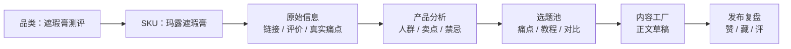

# 小红书AI内容工作流-遮瑕膏测评-新手实战版

## 一句话结论

这套学员包的价值不在于“教你写一篇文案”，而在于把一个产品从原始信息、用户评价、竞品素材，一路串到选题和正文草稿，形成可重复的内容流水线。

如果是零基础学习，我建议先只学一个场景：`遮瑕膏测评`，主产品用 `玛露遮瑕膏`。这个场景的数据足够完整，痛点足够具体，最适合把“投喂 -> 分析 -> 选题 -> 写稿 -> 复盘”跑通。

## 专业判断

### 这套材料做对了什么

- 数据链路完整，不是单纯的文案课。
- 目录分层清楚，能把输入、加工、输出拆开。
- 真实评价和达人笔记都很丰富，适合训练 AI 做内容归纳。

### 对新手不友好的地方

- 默认读者已经知道品类、SKU、素材库、选题池分别是什么。
- 默认读者知道“先分析再写稿”，而不是上来就让 AI 直接写。
- 默认读者知道怎么把一堆材料压缩成一个可执行的学习路径。

### 我的整理原则

- 只保留一个品类：`遮瑕膏测评`
- 只保留一个主 SKU：`玛露遮瑕膏`
- 只保留一条主链路：`产品档案 -> 产品分析 -> 选题池 -> 正文草稿 -> 发布复盘`
- 先学内容逻辑，再学工具路径

## 这个场景为什么值得先学

### 1. 真实数据够完整

- 抖音旗舰店评价共 `417` 条，正向反馈主要集中在遮瑕效果、持妆、色号精准。
- 负向反馈主要集中在干、色号不合适、遮瑕力不足。
- 小红书达人笔记共 `46` 条，其中 `34` 条是视频，`12` 条是图文，已经有可观察的爆款样本。

### 2. 痛点够具体，方便转成内容角度

| 核心信息 | 可转成的内容角度 |
| --- | --- |
| 德系蜡质地 | 为什么“干”反而更扒肤 |
| 高遮瑕力 | 痘印、斑点、黑眼圈前后对比 |
| 持妆稳定 | 通勤、熬夜、全天不脱妆 |
| 色号精准 | 3号、8号、12号怎么选 |
| 6g容量 | 性价比和长期使用感 |

### 3. 选题方向很适合新手

新手先从这四类角度入手，最容易出第一批内容：

1. 痛点解决
2. 教程/手法
3. 对比测评
4. 品质解释

## 一张图看懂流程

## 零基础学习路线

### 第 1 步：先认清当前产品

你要先知道三件事：

- 当前品类是什么
- 当前 SKU 是什么
- 这次内容要服务哪一类人

在这个案例里，答案就是：

- 品类：`遮瑕膏测评`
- SKU：`玛露遮瑕膏`
- 目标：把真实痛点转成可发布的内容

### 第 2 步：先看原始信息，不要急着写

原始信息里最重要的不是链接数量，而是用户怎么夸、怎么骂。

这个案例里最值得先抓的三组词是：

- 遮瑕效果
- 持妆
- 色号选择

只要把这三组词吃透，后面的选题和正文就不会跑偏。

### 第 3 步：再看分析报告

分析报告的核心任务不是“总结得多漂亮”，而是帮你回答三件事：

- 这款产品最适合卖给谁
- 用户最在意什么
- 哪些说法不能乱写

在这个案例里，最清晰的三类人群是：

- 瑕疵困扰人群
- 黑眼圈重度人群
- 敏感泛红人群

### 第 4 步：再进选题池

对新手来说，第一批选题不要贪多。

最稳的做法是：

- 每次只围绕一个痛点
- 每条只解决一个问题
- 标题里先让用户知道“这条和我有关”

### 第 5 步：最后写正文

新手先把目标定低一点：

- 先写出 `300-500` 字的短文
- 开头先写场景，不要先报产品名
- 中段围绕一个卖点展开
- 结尾给出明确建议或下一步动作

## 这套内容里最该记住的事实

### 用户真实反馈的主线

- 好评主线：遮瑕效果、持妆、色号精准
- 差评主线：干、色号不合适、遮瑕力不足

### 适合内容表达的主线

- 黑眼圈 / 泪沟
- 痘印 / 斑点 / 泛红
- 教程 / 手法 / 上脸方式
- 品质解释 / 为什么“干”是优势而不是缺点

### 色号信息，建议新手先记住

- `3号`：偏黑眼圈、泪沟方向
- `8号`：偏深色斑点方向
- `12号`：偏红血丝、红痘印、泛红方向

## 第一条可落地的练习

今天只做一件事：

> 把 `玛露遮瑕膏` 写成一条针对黑眼圈人群的内容。

你可以按这个顺序来：

1. 先定痛点：黑眼圈或泪沟
2. 再定角度：为什么 3 号色更适合
3. 再定结构：场景开头 -> 使用方式 -> 效果对比 -> 购买建议
4. 最后定长度：先写一篇短稿，不要一开始就追求完美

如果只想先完成一个最小成果，标准就定成这四条：

- 能讲清楚这个产品卖给谁
- 能从评价里提炼出 3 个高频痛点
- 能给出 3 条能发的选题
- 能写出 1 篇完整正文草稿

## 新手最容易踩的坑

1. 先写文案，后看数据
2. 选题太多，导致每条都很散
3. 只写产品功能，不写用户场景
4. 忽略“干”这种负面词背后的内容价值
5. 把品类和 SKU 混为一谈

## 如果你要继续往下学

- 先看 [Claude Code 快速参考指南](./Claude%20Code%20快速参考指南.md)
- 再看 [Claude Code 学习索引总表](./Claude%20Code%20学习索引总表.md)
- 如果你想把这套材料继续整理成更完整的学习地图，就把这篇笔记当成一个场景卡片继续扩展

