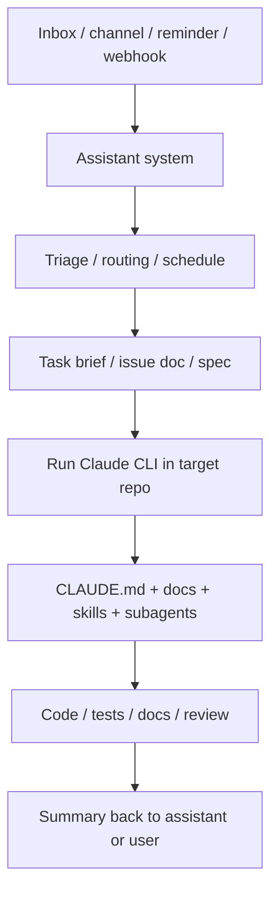

# Long-Lived Assistant Systems + Claude CLI Integration Guide

This page answers two practical questions:

1. How should any long-lived assistant system hand work into a Claude CLI repo workflow?
2. What should be shared across the boundary, especially for MCP, credentials, and tools?

"Long-lived assistant system" is a general category here, not one specific product.

It can be:

- a Telegram, Discord, or Slack bot
- a desktop assistant app
- a cron + inbox + reminder loop
- a small FastAPI or Node control plane
- a local script that keeps memory, reminders, or task state over time
- OpenClaw

If it owns intake, reminders, routing, follow-up, or result delivery, it belongs to the outer loop described here.

Related reading:

- [Personal assistant / knowledge system workflow](../HOW_TO_START_ASSISTANT_SYSTEM.md)
- [Existing repo workflow](../HOW_TO_START_EXISTING_PROJECT.md)
- [OpenClaw Agents vs Claude CLI Agents](OPENCLAW_AND_CLAUDE_AGENTS.md)

---

## Short answer first

### 1. The stable split is: assistant system outside, Claude CLI inside the repo

The clean mental model is not "the outer system directly drives each Claude subagent file."
It is:

- the assistant system receives, triages, schedules, and routes work
- the assistant system starts a Claude CLI session inside the target repo
- the Claude CLI main session then decides how to use `CLAUDE.md`, docs, `.claude/agents/`, and `.claude/skills/`

So the real call chain is closer to:

```text
Assistant system
  -> choose target repo
  -> run claude -p "..."
  -> Claude CLI main session takes over
  -> Claude CLI uses repo-local docs / skills / subagents
```

### 2. This pattern does not require multiple machines

This boundary is a **responsibility boundary** first, not a **machine boundary**.

One laptop is enough:

- the assistant system can receive work and keep state
- Claude CLI can run on that same machine
- the result can go back into that same assistant system

Multiple machines are a deployment choice, not a requirement.

### 3. Share services and credentials, not config files by assumption

The safer default is:

- sharing the same external services, yes
- sharing the same credentials, often yes
- assuming both systems automatically read the same MCP or settings files, no

---

## The most natural integration pattern

The strongest pattern is:

- **long-lived assistant system on the outside**
- **Claude CLI on the inside**



If you only have one computer, the same flow still holds. The boxes are just logical layers running on one machine.

---

## Keep the boundary this clean

### The assistant system owns

- where work comes from
- when it should run
- reminders, follow-up, queueing, or approval
- deduplication and prioritization
- which repo should receive the task
- where the final result should go back

### Claude CLI owns

- entering one specific repo deeply
- understanding current code, branch state, and project constraints
- using project `CLAUDE.md`
- using repo-local docs, skills, and subagents
- implementation, verification, review, and delivery

One-line version:

- **the assistant system decides whether, when, and where**
- **Claude CLI decides how repo work gets done and verified**

---

## When to use this pattern

Use it when:

- work first appears in an inbox, message channel, reminder, form, or webhook
- you have more than one repo and need routing
- you want long-lived memory, follow-up, queueing, or approval
- you want a clean split between external communication and repo execution

Do not use it when:

- you are just sitting in one repo coding
- the task does not need intake, routing, or result delivery
- there is no long-lived state or automation need

If your real need is just:

- write code
- run tests
- review code
- maintain one repo

then Claude CLI alone is enough. Do not add an outer loop just because you can.

---

## Three common handoff patterns

### Pattern A: pass a concise task summary directly into Claude CLI

This is the lightest option.

```bash
cd /path/to/repo
claude -p "Read CLAUDE.md and the relevant docs first, then fix the login callback timeout. At the end output only: 1. files changed 2. verification run 3. manual follow-up needed"
```

Good when:

- the task is already clear
- you do not need a durable bridge artifact
- you want the fastest path from intake to repo execution

### Pattern B: create a bridge document first, then let Claude CLI execute against it

This is usually more reliable.

For example, the assistant system writes one of these inside the target repo:

- `docs/inbox/task-014.md`
- `docs/issues/issue-014.md`
- `docs/triage/login-timeout.md`

Then it runs:

```bash
cd /path/to/repo
claude -p "Read CLAUDE.md and docs/inbox/task-014.md, implement the work, update related docs, and end with files changed / verification / manual follow-up."
```

Benefits:

- clearer task boundaries
- easier review
- easier reruns
- less reliance on one-off chat context
- better auditability

### Pattern C: add a human gate before Claude CLI starts

If the task involves:

- external sending
- broad file changes
- high-risk commands
- production systems

then the assistant system can stop after:

- detecting the task
- preparing the brief
- requesting approval

and only launch Claude CLI after approval.

This is often the most controllable operating model.

---

## Where Claude CLI subagents fit

This is the part that gets mixed up most often.

The stable model is:

1. the assistant system is not operating directly on `.claude/agents/*.md`
2. the assistant system hands work to the **Claude CLI main session**
3. the Claude CLI main session then decides whether to use subagents

So the real layering is:

```text
Assistant system
  -> Claude CLI main session
     -> Claude CLI subagents
```

That keeps two things healthy:

- repo specialists stay defined inside the repo
- the outer assistant does not become a god scheduler for every internal repo role

---

## What "sharing MCP" really means

It helps to think in three layers.

### Layer 1: sharing the same external services

This is usually fine.

Examples:

- maps
- email
- GitHub API
- search
- internal retrieval services

Those services can be connected to multiple systems.

### Layer 2: sharing the same credentials

Also usually fine, but it is cleaner to keep credentials in:

- environment variables
- a secret manager
- the assistant system's secure config surface
- Claude Code's supported secure config surface

Instead of scattering secrets across repo files.

### Layer 3: sharing the exact same config file

This is where people over-assume.

For Claude Code, repo-scoped MCP is typically defined in `.mcp.json`, while project behavior and local constraints usually live under `.claude/` and user-wide `~/.claude/` scopes.

Your assistant system will usually have its own:

- config files
- runtime injection layer
- plugin system
- secret entry points

So the safer conclusion is:

- **shared services, yes**
- **shared credentials, often yes**
- **explicit bridging of selected config, possible**
- **automatic universal file sharing, do not assume it**

---

## Recommended MCP strategy

### Capabilities you want everywhere

Examples:

- search
- maps
- email
- general documentation lookup

If these are mainly for Claude CLI across many repos, prefer Claude Code user scope.

### Capabilities clearly tied to one repository

Examples:

- a repo-specific database
- a repo-specific internal API
- a project-local tool that only makes sense in that repo

Prefer the repo's `.mcp.json`.

### Capabilities the assistant system needs to own long term

Examples:

- inbox automation
- cross-channel message handling
- routing and scheduling
- reminders and follow-up

Prefer the assistant system's own config side.

One-line summary:

- **repo-specific capabilities live close to the repo**
- **assistant-specific capabilities live close to the assistant system**
- **the thing you share is usually the service and the credential, not the file itself**

---

## Single-computer setups are still first-class

If you only have one machine, the smallest workable version is usually:

1. the assistant system receives the task
2. the assistant system decides whether repo execution is needed
3. the assistant system writes a task brief, or builds one prompt
4. the assistant system runs `claude -p`
5. Claude CLI completes implementation and verification in the repo
6. the assistant system records the result, sends a notification, or leaves a follow-up

So "assistant system + Claude CLI" does not imply:

- a Mac plus a Linux box
- a remote worker pool
- a distributed cluster
- a multi-node control plane

Those are scaling choices, not the minimum pattern.

---

## Common failure modes

### Failure 1: the assistant system tries to do deep repo implementation itself

That mixes long-lived memory, intake context, and repo-local implementation context into one messy layer.

### Failure 2: Claude CLI subagents are treated like long-lived schedulers

Claude CLI subagents are great for focused repo work, not for always-on routing or duty cycles.

### Failure 3: one MCP file is expected to feed both systems automatically

The cleaner design is separate config surfaces with explicit bridging where needed.

### Failure 4: there is no bridge artifact

Without a task brief, issue doc, triage note, or spec, the system becomes overly dependent on one-off chat context and gets much harder to rerun or review.

### Failure 5: the split starts with machines instead of responsibilities

The right order is:

- define responsibility boundaries first
- decide deployment layout second

---

## Rule of thumb

If you remember one sentence, make it this:

- **the long-lived assistant system owns where work comes from, when it runs, and where the result goes back**
- **Claude CLI owns what happens after entering the repo, including how the work gets done and verified**

That is the stable integration boundary.
