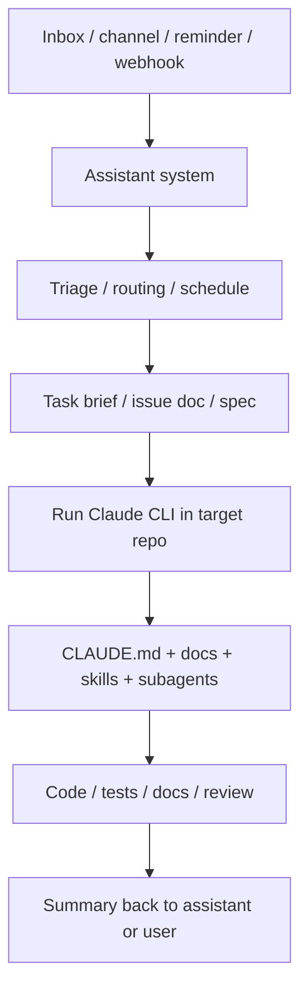

# 长期在线助理系统 + Claude CLI 集成指南

这篇文档专门回答两个很实际的问题：

1. 任何长期在线助理系统，应该怎样把任务稳定地交给 Claude CLI 仓库工作流？
2. MCP、凭据、工具能力，到底应该共享到哪一层？

这里说的“长期在线助理系统”是一个通用概念，不限定具体实现。

它可以是：

- Telegram / Discord / Slack bot
- 桌面助理应用
- cron + inbox + reminder 组合
- 一个常驻的 FastAPI / Node 服务
- 一个你手动触发、但长期维护状态和记忆的本地脚本
- OpenClaw

如果它负责“收件、提醒、路由、跟进、回写结果”，它就属于这里说的外环。

在这套教程体系里，需要把两个仓库分开理解：

- **这个 `claude_cli` 仓库** 负责 Claude CLI 侧的工作流、`CLAUDE.md`、skills、subagents 和 repo execution 模式
- **长期在线助理系统的默认参考实现** 是独立仓库 [`autonomous-agent-stack`](https://github.com/srxly888-creator/autonomous-agent-stack)

也就是说，这篇文档里的“长期在线助理系统”不是一个抽象空壳。
在本教程语境里，如果你想要一个现成、工程化、可继续扩展的外环，默认就指向 `autonomous-agent-stack` 这条实现线。

相关阅读：

- [个人助理 / 知识系统工作流](../HOW_TO_START_ASSISTANT_SYSTEM_CN.md)
- [现有项目工作流](../HOW_TO_START_EXISTING_PROJECT_CN.md)
- [OpenClaw Agent 与 Claude CLI Agent：异同与互补](OPENCLAW_AND_CLAUDE_AGENTS_CN.md)

---

## 先给结论

### 1. 最稳的分工是：助理系统做外环，Claude CLI 做仓库执行器

更稳的理解方式不是“外环系统直接控制 Claude 的每个子代理”，而是：

- 助理系统负责收件、分类、提醒、调度、选仓库
- 助理系统在目标仓库里启动一次 Claude CLI 主会话
- Claude CLI 主会话再根据仓库内的 `CLAUDE.md`、文档、`.claude/agents/`、`.claude/skills/` 决定怎么做

也就是说，真正稳定的调用链更像：

```text
Assistant system
  -> choose target repo
  -> run claude -p "..."
  -> Claude CLI main session takes over
  -> Claude CLI uses repo-local docs / skills / subagents
```

### 2. 这套模式不要求多机，单机也完全成立

这条边界首先是**职责边界**，不是**机器边界**。

你可以只有一台电脑：

- 同一个助理进程负责收件和提醒
- 同一台机器上的 Claude CLI 负责进入仓库执行
- 结果再回到同一个助理系统

多机只是部署形态，不是工作流前提。

### 3. 能共享的是“服务和凭据”，不是默认共享“同一份配置文件”

更稳的做法是：

- 共享同一套外部服务，可以
- 共享同一套凭据，可以
- 默认假设助理系统和 Claude CLI 自动读取同一份 MCP / settings 文件，不要这样假设

---

## 一条最推荐的集成链路

最自然的组合是：

- **长期在线助理系统做外环**
- **Claude CLI 做内环**



如果你只有一台电脑，上面这整条链路依然成立。区别只是所有方框都跑在同一台机器上。

---

## 在这套教程里，推荐怎样理解 `autonomous-agent-stack`

如果你想找一个“不是概念图，而是真能落地”的外环实现，推荐把 [`autonomous-agent-stack`](https://github.com/srxly888-creator/autonomous-agent-stack) 理解成这几个东西的组合：

- 一个长期在线的控制面
- 一个统一的收件、会话、记忆和路由层
- 一个可审计的任务分发与执行状态层
- 一个把任务送进 Claude CLI 或其他执行器的桥接层

最重要的是，它并不要求你先上多机或多 worker。

它可以先只做：

- 单机收件
- 单机 session / memory
- 单机 task brief
- 单机运行 `claude -p`
- 单机记录结果和人工审批

之后再按需要扩到：

- webhook / Telegram / panel
- queue / worker / lease
- 审批流
- 远端执行节点

所以这篇文档虽然用了“长期在线助理系统”这个通用词，但在本教程组合里，最推荐的具体落点就是 `autonomous-agent-stack`。

---

## 分工最好保持成这样

### 助理系统负责

- 任务从哪里来
- 什么时候跑
- 要不要提醒或跟进
- 要不要做去重、优先级排序、人工审批
- 这件事应该进哪个仓库
- 最终结果要回到哪个频道、收件箱、面板或记忆系统

### Claude CLI 负责

- 进入某个具体仓库
- 理解当前代码、分支和项目约束
- 使用项目级 `CLAUDE.md`
- 使用项目级 docs / skills / subagents
- 修改、测试、审查、交付

一句话说：

- **助理系统决定“要不要做、何时做、送去哪”**
- **Claude CLI 决定“进仓库之后怎么做、怎么验”**

---

## 什么时候该用这条模式

适合：

- 任务先出现在 inbox、消息、提醒、表单、webhook 里
- 你有多个仓库，需要先判断任务该去哪
- 你想保留长期记忆、提醒、跟进、队列、审批
- 你希望仓库执行和外部沟通分层

不适合：

- 你只是坐在一个仓库里写代码
- 任务不需要收件、调度、回写结果
- 没有长期状态或自动化需求

如果你的核心诉求只是：

- 写代码
- 跑测试
- 做代码审查
- 维护单个仓库

那直接只用 Claude CLI 就够了，不必为了“多一层系统”而多一层系统。

---

## 三种最常见的交接方式

### 方式 A：直接把任务摘要交给 Claude CLI

这是最轻的一种。

```bash
cd /path/to/repo
claude -p "请先阅读 CLAUDE.md 和相关 docs，再处理这个任务：修复登录页回调超时。最后只输出：1. 修改了哪些文件 2. 跑了哪些验证 3. 还需人工确认什么"
```

适合：

- 任务已经很清楚
- 不需要留存太多中间产物
- 你想最低成本接上外环

### 方式 B：先写桥接文档，再让 Claude CLI 执行

这通常更稳，也更适合长期运行。

例如助理系统先在目标仓库里写：

- `docs/inbox/task-014.md`
- `docs/issues/issue-014.md`
- `docs/triage/login-timeout.md`

然后再执行：

```bash
cd /path/to/repo
claude -p "请阅读 CLAUDE.md 和 docs/inbox/task-014.md，完成实现并更新相关文档。最后输出 files changed / verification / manual follow-up。"
```

这样好处是：

- 任务边界更清楚
- 更适合审查
- 更适合重跑
- 对话上下文压力更小
- 结果更容易沉淀

### 方式 C：先走人工闸门，再启动 Claude CLI

如果任务涉及：

- 对外发送
- 大范围改动
- 高风险命令
- 生产环境

那助理系统可以先只做：

- 识别任务
- 产出任务摘要
- 请求确认

确认后再进入 Claude CLI 仓库执行。

这通常是最可控的做法。

---

## Claude CLI 子代理在这条链路里处于什么位置

最容易混的点在这里。

更稳的心智模型是：

1. 助理系统不直接面向某个 `.claude/agents/*.md` 文件工作
2. 助理系统把任务交给 **Claude CLI 主会话**
3. Claude CLI 主会话再决定是否调用子代理

所以分层应该理解成：

```text
Assistant system
  -> Claude CLI main session
     -> Claude CLI subagents
```

这样有两个明显好处：

- 仓库内专家角色仍然留在仓库里定义
- 外环系统不会变成“直接遥控仓库内部每个角色”的上帝调度器

---

## 这套方案相对“概念对比”真正强在哪里

[OpenClaw Agent 与 Claude CLI Agent：异同与互补](OPENCLAW_AND_CLAUDE_AGENTS_CN.md) 那篇主要解决的是：

- 名词别混
- 层级别混
- 谁像长期大脑，谁像仓库内专家，谁像临时后台 worker

它回答的是**“它们分别是什么”**。

而这篇文档要解决的是**“系统真正跑起来以后，为什么这种外环 / 内环切法更有优势”**。

优势主要有 6 个：

### 1. 安全边界更清楚

你不需要让长期在线助理直接拿着一大堆 repo 内角色定义和仓库写权限到处跑。

更稳的做法是：

- 外环只负责收件、路由、审批、回写
- 仓库写入和验证留在 Claude CLI 这一层

这会让高风险动作更容易被看见和拦住。

### 2. 审计和重跑更容易

一旦中间有 task brief、issue doc、triage note、spec，这条链路就不再完全依赖一次性聊天上下文。

这意味着你可以：

- 回看当时为什么这么派单
- 在同一份 brief 上重跑
- 让别的执行器接手同一个 brief
- 做更像工程系统的审查，而不是只看聊天记录

### 3. 单机起步更自然

“概念对比”容易让人误以为这是一套只有多机、多 agent、多渠道才值得搞的系统。

其实不是。

这条方案最大的现实优势之一恰恰是：

- 一台电脑就能起步
- 一开始不需要远端 worker
- 一开始不需要分布式调度
- 一开始就能把边界定对

也就是先把结构做对，再决定要不要扩部署。

### 4. 仓库内部角色可以继续独立演化

如果外环直接耦合仓库里的每个专家角色，后面你一改 `.claude/agents/`，外环调度逻辑也得跟着改。

而现在这种分法里：

- 外环只面向 Claude CLI 主会话
- 仓库内部怎么拆 skills / subagents，是仓库自己的事

这能显著降低耦合。

### 5. 失败隔离更好

任务失败时，你更容易判断问题在哪一层：

- 是收件和分类错了
- 是桥接文档写差了
- 是 Claude CLI 在 repo 内实现失败了
- 是验证没跑
- 是审批没过

这比“所有事情都堆在一个长期助理脑里”更容易排错。

### 6. 从个人助理到工程控制面有连续升级路径

如果你以后要把系统做大，这条边界天然支持逐步演进：

1. 单机助理 + Claude CLI
2. 助理系统 + 审批 + 面板
3. 助理系统 + queue / worker
4. 助理系统 + 多执行节点

中间不用推翻整个模型。

这就是它相对“只停留在名词对比”更有价值的地方。

---

## 如果你要用 `autonomous-agent-stack` 搭这一层，最稳的最佳实践

最稳的顺序不是“先把 Telegram、worker、cron、审批、远端节点全接上”，而是：

### 阶段 1：先做单机最小闭环

先只证明这 5 件事：

1. 能收任务
2. 能持久化 session / memory
3. 能判断任务是否要进某个 repo
4. 能生成 task brief
5. 能在 repo 里跑一次 `claude -p` 并回收结果

这一步如果没稳，后面多机、多渠道只会放大混乱。

### 阶段 2：把 bridge artifact 定成制度

不要让外环和 Claude CLI 长期靠一句话硬连。

至少固定一种桥接产物：

- `docs/inbox/*.md`
- `docs/issues/*.md`
- `docs/triage/*.md`

并固定输出字段，例如：

- files changed
- verification
- manual follow-up
- evidence

### 阶段 3：先把敏感动作闸住

对于这些动作，默认走人工确认：

- 对外发送
- 删除 / 大范围写入
- 生产环境操作
- 高成本任务

外环的价值之一，不是替你鲁莽自动化，而是替你把高风险动作收口。

### 阶段 4：把记忆分层，而不是全塞主会话

至少分成三类：

- 原始输入
- task brief / routing note
- 长期记忆 / 稳定决策

这样后面审计、重跑、压缩上下文都会轻很多。

### 阶段 5：最后再加调度和 worker

只有当单机闭环已经稳定后，再加：

- cron / heartbeat
- queue / lease
- standby worker
- 远端执行节点

顺序不要反。

### 一句话最佳实践

对 `autonomous-agent-stack` 这类外环，最好的起步顺序是：

- **先把职责边界做对**
- **再把桥接产物做实**
- **再把审批和记忆收口**
- **最后才扩执行面**

---

## MCP 到底怎么共享

建议把“共享”分成三层看。

### 第 1 层：共享同一套外部服务

这个通常没问题。

例如：

- 地图
- 邮件
- GitHub API
- 搜索
- 内部检索服务

这些服务本来就可以同时被多个系统接入。

### 第 2 层：共享同一套凭据

这通常也可以，但更推荐把凭据放在：

- 环境变量
- Secret manager
- 助理系统自己的安全配置入口
- Claude Code 自己支持的安全配置入口

而不是把敏感值散在多个仓库文件里。

### 第 3 层：共享同一份配置文件

这层最容易误判。

对 Claude Code 来说，仓库级 MCP 通常放在 `.mcp.json`，项目行为和本地约束通常放在 `.claude/` 以及用户级 `~/.claude/` 相关作用域里。

而外环助理系统通常有它自己的：

- 配置文件
- runtime 注入面
- 插件系统
- secret 入口

所以更稳的结论是：

- **共享服务，可以**
- **共享凭据，可以**
- **显式桥接部分配置，可以**
- **默认假设两边自动共用一份配置文件，不要这样设计**

---

## 最推荐的 MCP 配置策略

### 全局常用、跨仓库都想用的能力

例如：

- 搜索
- 地图
- 邮件
- 通用文档检索

如果这些主要是给 Claude CLI 用，优先放在 Claude Code 的用户级配置里。

### 明显跟某个仓库绑定的能力

例如：

- 当前仓库专属数据库
- 当前仓库专属内部 API
- 只对这个项目有意义的本地工具

优先放在这个仓库的 `.mcp.json`。

### 助理系统本身要长期在线使用的能力

例如：

- inbox 自动化
- 跨渠道消息处理
- 路由与调度
- 提醒和跟进

优先放在助理系统自己的配置侧。

一句话总结：

- **Repo-specific 的能力贴近仓库放**
- **Assistant-specific 的能力贴近助理系统放**
- **共享的是服务与凭据，不一定是文件本身**

---

## 单机实现其实很简单

如果你只有一台电脑，最小可行版本通常是：

1. 助理系统接收任务
2. 助理系统判断是否需要进仓库
3. 助理系统在目标仓库里写一份任务摘要，或直接组织一段 prompt
4. 助理系统运行 `claude -p`
5. Claude CLI 在仓库里完成修改和验证
6. 助理系统记录结果、发通知、留待办

也就是说，“长期在线助理系统 + Claude CLI”并不等于：

- 一台 Mac
- 一台 Linux
- 一个远端 worker 池
- 一堆分布式节点

那些是部署扩展，不是最小前提。

---

## 最容易踩的坑

### 坑 1：让助理系统承担太多仓库深度实现

这样很容易把长期记忆、收件上下文和单仓库实现上下文搅在一起。

### 坑 2：把 Claude CLI 子代理当长期调度器

Claude CLI 子代理适合“当前仓库里的专项分工”，不适合承担长期在线和值班调度。

### 坑 3：以为一份 MCP 文件能天然喂给两个系统

更稳的做法是按系统边界配置，再显式桥接，不要隐式耦合。

### 坑 4：没有桥接产物

如果两边之间没有 task brief、issue doc、triage note、spec 这一层，系统会越来越依赖一次性对话上下文，后面会很难重跑和审查。

### 坑 5：先按机器分，再按职责补救

正确顺序应该反过来：

- 先定职责边界
- 再决定要不要拆机器

---

## 一句经验法则

如果你只记一句话，记这个：

- **长期在线助理系统负责“任务从哪来、什么时候跑、结果回哪去”**
- **Claude CLI 负责“进入当前仓库后，谁来做、怎么做、怎么验”**

这就是最稳的集成边界。
