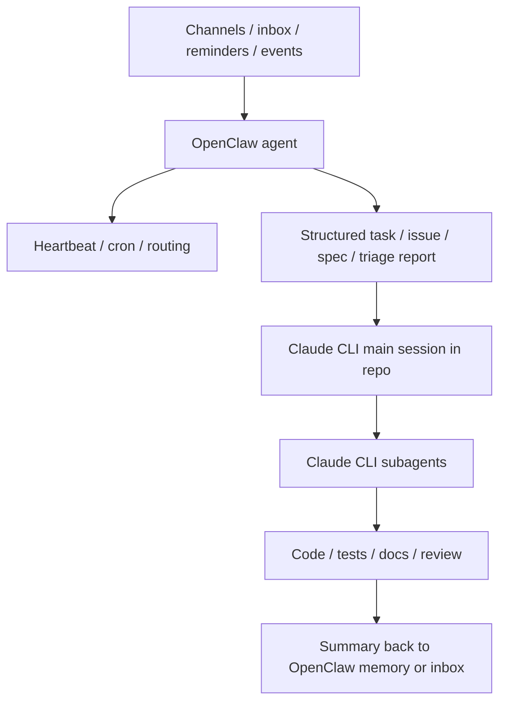

# OpenClaw Agents vs Claude CLI Agents: Differences, Overlap, and How They Fit Together

This document answers a question that becomes confusing very quickly:

- What is a Claude CLI subagent?
- What is an OpenClaw agent?
- What is an OpenClaw subagent?
- Are they interchangeable?
- If you use both, how should they complement each other instead of competing?

If your question is more operational, especially “how does OpenClaw hand work into Claude CLI?” or “what does sharing MCP really mean?”, read this first:

- [OpenClaw + Claude CLI Integration Guide](OPENCLAW_CLAUDE_INTEGRATION.md)

The shortest useful answer is:

- A **Claude CLI subagent** is a focused specialist inside a repo-centric coding workflow.
- An **OpenClaw agent** is a long-lived brain inside the Gateway with its own workspace, sessions, and automation surface.
- An **OpenClaw subagent** is a temporary background worker spawned by an OpenClaw agent during a run.

These ideas rhyme, but they do not live at the same layer.

---

## Terminology Map

| Concept | Where it lives | Lifecycle | Best at |
|---|---|---|---|
| Claude CLI main session | Your current Claude Code session in a repo | Usually one active development session | Reading the repo, editing code, testing, shipping work |
| Claude CLI subagent | A role defined in `.claude/agents/` or `~/.claude/agents/`, delegated by the current session | Short-lived around the current task | Code review, tests, migration checks, focused implementation |
| OpenClaw agent | A first-class `agentId` in the Gateway with its own workspace, agentDir, and sessions | Long-lived and routable | Personal assistant duties, inbox handling, long-term memory, automation |
| OpenClaw subagent | A background run spawned from a current OpenClaw run | Temporary, one-off background work | Parallel research, slow tasks, background summarization |
| OpenClaw cron / heartbeat | Built-in Gateway scheduling surfaces | Long-lived | Scheduling, reminders, periodic checks, wakeups |

---

## What They Have In Common

They do share important ideas:

- Both split work into narrower roles instead of one giant assistant.
- Both rely on stable instructions instead of rewriting prompts every time.
- Both can reduce context pollution in the main interaction.
- Both work better when responsibilities are explicit.
- Both become more useful when paired with clear tool boundaries and output expectations.

That overlap is real. The mistake is assuming they solve the same level of problem.

---

## The Core Difference

| Dimension | Claude CLI subagent | OpenClaw agent | OpenClaw subagent |
|---|---|---|---|
| Control plane | Lives inside the current Claude Code session | First-class Gateway object | Spawned from a current OpenClaw run |
| Primary scope | One repo and one active development task | A long-lived assistant system | Background work for the current OpenClaw conversation |
| State model | Repo context, `CLAUDE.md`, current task state | Workspace, `AGENTS.md`, `SOUL.md`, `USER.md`, sessions, routing | Partial inherited context, then reports back |
| Lifetime | Usually task-scoped | Persistent | Temporary |
| Trigger surface | Auto-delegation or explicit use inside Claude Code | Incoming messages, bindings, cron, heartbeat, webhooks | Explicit spawn during a run |
| Scheduling | Usually external to the subagent itself | Native Gateway cron and heartbeat support | Not a long-lived scheduler |
| Typical jobs | Review, testing, migration, focused implementation | Inbox, reminders, multi-channel coordination, long-term workflows | Parallel research, slow tools, offloaded analysis |
| Session semantics | Tied to the current coding session | Per-agent session store with main/group/custom session patterns | Dedicated child session that announces back |

The practical reading is:

1. Claude CLI subagents are for **specialization inside a repo workflow**.
2. OpenClaw agents are for **persistent assistant brains**.
3. OpenClaw subagents are for **temporary background execution inside that assistant system**.

---

## Why OpenClaw Agents Are Not the Same as Claude CLI Subagents

Claude CLI subagents are fundamentally repo-centric.

They are usually things like:

- `code-reviewer`
- `test-runner`
- `migration-auditor`
- `frontend-builder`

They care about:

- the current codebase
- the current branch
- the current task
- the current project conventions

They usually do not need to be:

- always online
- routable from multiple chat channels
- scheduled every morning
- responsible for long-lived personal memory

OpenClaw agents solve a broader, longer-running problem:

- they have their own workspace
- they have their own agent state and session history
- they can be bound to channels, accounts, or peers
- they can be woken by cron or heartbeat
- they can act as distinct brains inside one Gateway

That is not just "a focused coding role". It is a system architecture concept.

---

## Why OpenClaw Subagents Are Also Not the Same

If anything in OpenClaw feels closest to a Claude CLI subagent, it is the OpenClaw subagent. But even there, the mapping is not exact.

Shared traits:

- both offload specialized work
- both help isolate context
- both help keep the main interaction cleaner
- both are useful for slow or focused tasks

But the intent differs:

- Claude CLI subagents are long-defined specialists for repo work.
- OpenClaw subagents are temporary background runs created from a current session.
- Claude CLI subagents are designed around coding workflows.
- OpenClaw subagents are designed around Gateway conversations and announce-back behavior.

So the better mental model is:

- Claude CLI subagent = reusable repo specialist
- OpenClaw subagent = temporary background worker

---

## Memory, Workspace, and Context

### Claude CLI side

Claude CLI is strongest when the center of gravity is a repo:

- codebase structure
- active branch
- current edits
- `CLAUDE.md`
- build, test, lint, and project conventions

That makes it excellent for:

- deep repo understanding
- implementation
- test execution
- code review
- documentation tied to the code

### OpenClaw side

OpenClaw is strongest when the center of gravity is a long-running assistant:

- per-agent workspace
- `AGENTS.md`, `SOUL.md`, `USER.md`
- session store
- memory files
- channel routing
- cron and heartbeat

That makes it excellent for:

- always-on assistance
- long-term memory
- multi-channel input
- reminders and scheduling
- background monitoring

---

## Scheduling: Who Owns "When This Runs"

This is one of the cleanest dividing lines.

### Claude CLI

Claude CLI is great for:

- active coding sessions
- one-off headless runs
- scripts that are triggered from the outside

But timing is usually handled by something else:

- `cron`
- `launchd`
- CI
- another orchestrator

### OpenClaw

OpenClaw includes scheduling as part of its control plane:

- cron
- heartbeat
- wakeups
- delivery back to a channel

So:

- in Claude CLI, scheduling is usually an outer wrapper
- in OpenClaw, scheduling is part of the system itself

This is why recurring jobs like `inbox-triager` feel more native in OpenClaw.

---

## The Most Useful Way to Combine Them

The best design is not replacement. It is layering.

### OpenClaw as the outer loop

OpenClaw should own:

- message intake
- inbox handling
- reminders
- recurring checks
- long-term assistant memory
- routing tasks to the right long-lived brain

### Claude CLI as the inner loop

Claude CLI should own:

- deep repo analysis
- planning inside the codebase
- implementation
- testing
- code review
- project-specific subagents and skills

This gives each system the layer it is actually best at.

---

## Pattern 1: OpenClaw Outside, Claude CLI Inside

This is the most recommended combined setup.

Use OpenClaw to:

- watch inboxes
- run recurring triage
- create structured tasks
- decide what should become a repo task

Then use Claude CLI to:

- enter the repo
- use project subagents
- implement and verify the change

This is a clean split between assistant orchestration and repo execution.

---

## Pattern 2: OpenClaw Manages Long-Lived Brains, Claude CLI Manages Repo Specialists

Example OpenClaw agents:

- `work`
- `life`
- `inbox-triager`
- `project-manager`

Example Claude CLI subagents inside one repo:

- `code-reviewer`
- `test-runner`
- `doc-writer`

In this setup:

- OpenClaw decides which long-lived brain should own the task.
- Claude CLI decides which repo-local specialist should execute inside the codebase.

That is system orchestration vs repo specialization.

---

## Pattern 3: OpenClaw for Inbox Triage, Claude CLI for Repo Execution

This is especially useful for the `inbox-triager` use case.

### OpenClaw layer

Create a dedicated `inbox-triager` agent that:

- scans inbox sources on a schedule
- classifies entries
- deduplicates them
- assigns priority
- writes a triage report
- decides which items deserve entry into a repo workflow

### Claude CLI layer

Once an item becomes an actual repo task, Claude CLI takes over:

- inspect the codebase
- produce a plan
- delegate to `code-reviewer`, `test-runner`, or other project subagents
- implement and verify

This keeps OpenClaw from becoming a heavy repo-execution surface and keeps Claude CLI from pretending to be a long-lived assistant daemon.

---

## When Claude CLI Alone Is Enough

You probably do not need OpenClaw if most of these are true:

- you care about one repo
- you mostly work from the terminal
- you do not need multi-channel input
- you do not need always-on behavior
- you do not need rich scheduling or reminders

In that case, `CLAUDE.md`, project skills, and repo-local subagents are usually enough.

---

## When OpenClaw Alone Is Enough

You may not need Claude CLI if the goal is mainly:

- long-lived personal assistance
- daily communication
- multi-channel inbox
- reminders
- recurring summaries
- lightweight automation

But once the center of gravity becomes "work deeply inside this repo", Claude CLI usually becomes the more natural tool.

---

## Decision Table

| Real need | Better primary tool |
|---|---|
| Build code-review, testing, and implementation specialists inside one repo | Claude CLI subagents |
| Run a long-lived assistant across channels | OpenClaw agent |
| Schedule daily inbox checks, reports, or reminders | OpenClaw agent + cron / heartbeat |
| Offload a slow background task from an active OpenClaw conversation | OpenClaw subagent |
| Offload focused review/test work from an active coding task | Claude CLI subagent |
| Combine assistant operations with repo execution | OpenClaw outside, Claude CLI inside |

---

## Common Design Mistakes

### Mistake 1: Using OpenClaw multi-agent routing as a substitute for repo-local specialist roles

That usually mixes two layers that should stay separate.

### Mistake 2: Treating Claude CLI subagents as a persistent scheduling system

Claude CLI subagents are great specialists, not long-lived schedulers.

### Mistake 3: Letting OpenClaw absorb too much deep repo implementation

It can do it, but the control surface and context cost are usually harder to keep clean than a dedicated Claude CLI repo workflow.

### Mistake 4: Treating OpenClaw subagents as durable identities

They are better seen as temporary background workers, not long-term brains.

---

## Recommended Layering

If you use both, this is a strong default:

### Layer 1: OpenClaw

Owns:

- always-on presence
- multi-channel intake
- reminders
- inbox
- cron
- heartbeat
- long-term assistant memory
- routing across long-lived agents

### Layer 2: Bridge artifacts

Use these to hand work into concrete repo workflows:

- GitHub issues
- triage reports
- spec docs
- TODO lists
- daily summaries

### Layer 3: Claude CLI

Owns:

- repo understanding
- planning and implementation
- project `CLAUDE.md`
- project skills
- project subagents
- tests, review, fixes, and delivery

This keeps the system easy to reason about:

- OpenClaw answers: "How does work arrive, when should it wake up, and which long-lived brain owns it?"
- Claude CLI answers: "Inside this repo, which specialist should do the work and how do we verify it?"

---

## One Rule of Thumb

If you only keep one sentence, keep this one:

- **OpenClaw answers who stays online, when it wakes up, and where tasks come from.**
- **Claude CLI answers who should implement, review, test, and deliver inside the current repo.**

Or even shorter:

- **OpenClaw is the outer assistant system**
- **Claude CLI is the inner repo workflow**

That is the most natural complementarity between them.

---

## Further Reading

- [HOW_TO_CREATE_AGENTS.md](../HOW_TO_CREATE_AGENTS.md)
- [HOW_TO_START_ASSISTANT_SYSTEM.md](../HOW_TO_START_ASSISTANT_SYSTEM.md)
- [OpenClaw Multi-Agent Routing](https://docs.openclaw.ai/concepts/multi-agent)
- [OpenClaw Agent Workspace](https://docs.openclaw.ai/concepts/agent-workspace)
- [OpenClaw Cron Jobs](https://docs.openclaw.ai/automation/cron-jobs)
- [OpenClaw Subagents](https://docs.openclaw.ai/tools/subagents)
