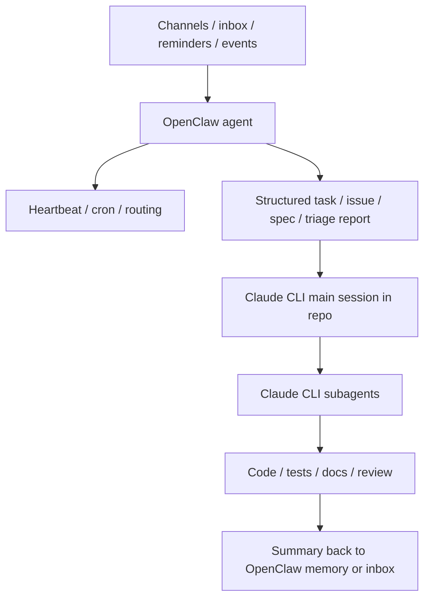

# OpenClaw Agent 与 Claude CLI Agent：异同与互补

这篇文档专门回答一个容易混淆的问题：

- Claude CLI 里的 `agent` / `subagent` 是什么
- OpenClaw 里的 `agent` / `subagent` 是什么
- 两者是不是同一类东西
- 如果同时使用，它们应该怎样分工，而不是互相替代

一句话先讲清：

- **Claude CLI 子代理** 更像“当前代码仓库里的专项专家”
- **OpenClaw agent** 更像“长期在线、带独立工作区和会话历史的一颗脑”
- **OpenClaw subagent** 更像“从 OpenClaw 当前会话里临时派出去的后台工人”

它们有相似性，但不在同一层。

---

## 先把名词对齐

| 概念 | 它活在哪里 | 生命周期 | 最擅长什么 |
|---|---|---|---|
| Claude CLI 主会话 | 当前仓库里的 Claude Code 会话 | 通常是一次开发会话 | 读仓库、改代码、跑命令、做实现 |
| Claude CLI 子代理 | `.claude/agents/` 或 `~/.claude/agents/` 的角色定义，由当前 Claude 会话委派执行 | 围绕当前任务的短时运行 | 代码审查、测试、迁移、文档、专项实现 |
| OpenClaw agent | Gateway 中的一个独立 agent id，有自己的 workspace、agentDir、sessions | 长期存在，可持续被路由和唤醒 | 个人助理、跨渠道 inbox、长期记忆、日常自动化 |
| OpenClaw subagent | 从某个 OpenClaw agent 的当前运行中派生的后台运行 | 一次性后台任务，完成后回报结果 | 并行研究、慢任务、后台总结 |
| OpenClaw cron / heartbeat | Gateway 内建调度机制 | 长期存在 | 定时、轮询、提醒、后台检查 |

最关键的区别不是“它们都叫 agent”，而是：

- **Claude CLI 子代理** 主要服务于一个正在进行的仓库级工作流
- **OpenClaw agent** 主要服务于一个长期运行的助理系统

---

## 它们相同的地方

虽然不是同一层，但它们确实有不少共同点：

- 都可以把“一个模糊的大助手”拆成更聚焦的角色
- 都依赖明确的 prompt / 说明文件来稳定行为
- 都强调缩小上下文范围，避免主会话越来越脏
- 都适合把高频职责沉淀成固定角色，而不是每次重写 prompt
- 都可以和工具权限、目录边界、输出格式结合起来做约束

所以你会感觉它们“很像”。这种感觉没错，但它们解决的是不同层次的问题。

---

## 核心区别

下面这张表比“它们都能当代理”更重要。

| 维度 | Claude CLI 子代理 | OpenClaw agent | OpenClaw subagent |
|---|---|---|---|
| 控制平面 | 附着在当前 Claude Code 会话内 | Gateway 的一级对象 | 某个 OpenClaw agent 当前运行下派生 |
| 主要作用域 | 单个仓库 / 单次开发任务 | 长期助理系统 / 多渠道 / 多工作区 | 当前 OpenClaw 会话的后台并行任务 |
| 状态与记忆 | 依赖仓库上下文、`CLAUDE.md`、当前任务上下文 | 有自己的 workspace、`AGENTS.md`、`SOUL.md`、`USER.md`、sessions | 继承父 agent 的一部分上下文，跑完后回报 |
| 生命周期 | 通常围绕当前任务存在 | 长期存在，可持续被路由、cron、heartbeat 唤醒 | 临时存在，完成即结束或归档 |
| 触发方式 | 当前开发会话自动委派或显式调用 | 渠道路由、用户消息、cron、heartbeat、webhook | 当前 OpenClaw 会话显式 spawn |
| 调度能力 | 本身不负责“定时” | 可直接和 Gateway 的 cron / heartbeat 配合 | 本身也不负责长期调度 |
| 典型工作内容 | 代码审查、测试执行、前端实现、迁移检查 | inbox 管理、提醒、跨渠道沟通、个人记忆、长期任务编排 | 后台研究、并行检索、慢工具调用、独立总结 |
| 会话语义 | 围绕当前 Claude Code 开发会话 | 每个 agent 有自己的 session store，支持 main / group / custom session | 自己的子会话，结果回报给请求者 |
| 多人 / 多渠道 | 不是重点 | 是核心能力之一 | 依附于 OpenClaw 的多渠道体系 |
| 最像什么 | 仓库内专家 | 长期在线助理的大脑 | 助理在一次对话里临时叫来的后台助手 |

可以把它们理解成三层：

1. **Claude CLI 子代理**：代码仓库内部的专项分工
2. **OpenClaw agent**：长期运行系统中的独立大脑
3. **OpenClaw subagent**：某个大脑为当前任务临时派出的后台 worker

---

## 为什么 OpenClaw agent 不等于 Claude CLI 子代理

这两者最容易被误认为是一一对应。

其实不是。

### Claude CLI 子代理关注的是“当前仓库里的角色分工”

例如：

- `code-reviewer`
- `migration-auditor`
- `test-runner`
- `frontend-builder`

这些角色依赖的是：

- 当前仓库代码
- 当前分支改动
- 当前项目约定
- 当前这次任务的目标

它们通常不需要：

- 长期在线
- 跨渠道路由
- 每天早上自动唤醒
- 管理 WhatsApp / Telegram / Slack / 日历 / 通知

### OpenClaw agent 关注的是“一个长期存在的助理脑”

例如：

- `main`
- `work`
- `family`
- `inbox-triager`
- `project-manager`

这些 agent 往往有自己的：

- workspace
- `AGENTS.md`
- `SOUL.md`
- `USER.md`
- 认证状态
- 会话历史
- 触发来源

它们考虑的是：

- 哪个渠道来的消息该进哪个 agent
- 哪些任务要 heartbeat 周期性检查
- 哪些任务要 cron 精准定时
- 哪些任务要单独隔离会话运行

这已经不是“仓库里的一个专家角色”，而是一整套长期运行系统的一部分。

---

## 为什么 OpenClaw subagent 也不等于 Claude CLI 子代理

如果要找“最像 Claude CLI 子代理”的东西，其实是 **OpenClaw subagent**，但两者依然不完全相同。

相似点：

- 都是从主运行里分出去处理专项任务
- 都有一定上下文隔离
- 都适合把慢任务、专门任务分出去
- 都可以减少主会话污染

不同点：

- Claude CLI 子代理是你在 Claude Code 里长期定义好的“专项角色”
- OpenClaw subagent 是从某个当前会话里临时 spawn 出去的一次后台运行
- Claude CLI 子代理天然围绕仓库工作流设计
- OpenClaw subagent 天然围绕 Gateway 会话和回报消息设计

换句话说：

- **Claude CLI 子代理** 是“仓库工作流中的专家定义”
- **OpenClaw subagent** 是“助理系统中的一次性后台执行体”

---

## 记忆、工作区和上下文的差异

这部分决定了它们应该怎么互补。

### Claude CLI 这边

Claude CLI 更偏“项目内上下文”：

- 当前 git 仓库
- 当前目录结构
- 当前改动
- 当前 `CLAUDE.md`
- 当前命令、测试、架构说明

它最强的是：

- 深入理解一个仓库
- 在同一个仓库里规划、修改、测试、审查
- 利用项目级子代理和技能做局部专业化

### OpenClaw 这边

OpenClaw 更偏“长期助理上下文”：

- 某个 agent 自己的 workspace
- `AGENTS.md` / `SOUL.md` / `USER.md`
- 会话历史
- memory 文件
- 渠道路由
- cron / heartbeat

它最强的是：

- 长期在线
- 长期记忆
- 多渠道接入
- 定时和后台任务
- 将不同类型的消息路由到不同 agent

所以如果你的需求是：

- “这个仓库里要一个测试专家”

优先想到 Claude CLI 子代理。

如果你的需求是：

- “每天 9 点自动检查 inbox，并把结果发到某个渠道”

优先想到 OpenClaw agent + cron。

---

## 调度与自动化：谁负责“什么时候跑”

这个问题是两者最本质的分界线之一。

### Claude CLI

Claude CLI 很适合：

- 当前人机交互开发
- 手动执行一次 headless 任务
- 搭配外部 scheduler 执行脚本

但“定时”通常不是它的内建核心控制面。

所以 Claude CLI 的常见模式是：

- `claude -p ...`
- 外部 `cron` / `launchd` / CI 去触发

### OpenClaw

OpenClaw 把定时和后台唤醒当作系统级能力：

- `cron`
- `heartbeat`
- `webhook`
- 多渠道 delivery

也就是说：

- 在 Claude CLI 里，**调度更像外围设施**
- 在 OpenClaw 里，**调度就是控制平面的一部分**

这就是为什么类似 `inbox-triager` 的长期任务，在 OpenClaw 里会显得更自然。

---

## 最实用的互补方式

真正有价值的不是争论“谁取代谁”，而是把层次分清。

---

## 模式 1：OpenClaw 做外环，Claude CLI 做内环

这是最推荐的组合。

分工如下：

- **OpenClaw**
  - 接消息
  - 定时跑任务
  - 做长期记忆
  - 做 inbox 分类
  - 决定什么时候该唤醒你
  - 决定是否需要把事情送进某个仓库工作流

- **Claude CLI**
  - 进入具体仓库
  - 理解代码
  - 调用项目级子代理
  - 改代码、跑测试、做审查、写文档

这是“常驻助理系统”和“仓库开发系统”最自然的分工。

---

## 模式 2：OpenClaw 管理多个长期脑，Claude CLI 管理单仓库专家

例如你有：

- 一个 `work` agent
- 一个 `life` agent
- 一个 `inbox-triager` agent

这些都是 **OpenClaw agent**。

而在某个具体代码仓库里，你再有：

- `code-reviewer`
- `test-runner`
- `doc-writer`

这些是 **Claude CLI 子代理**。

这时候的设计思路是：

- **OpenClaw agent** 负责“哪类事情应该被送到哪个系统”
- **Claude CLI 子代理** 负责“在这个仓库里由哪个专家来做”

前者是系统编排。

后者是仓库内分工。

---

## 模式 3：用 OpenClaw 做 inbox-triager，用 Claude CLI 做 repo executor

这个模式非常适合你前面 issue 里提到的需求。

建议分层如下：

### OpenClaw 层

建立一个独立的 `inbox-triager` agent，负责：

- 定时扫描 inbox
- 分类
- 去重
- 判断优先级
- 输出 triage report
- 决定哪些条目值得进入某个项目仓库

### Claude CLI 层

当某条 triage 结果已经进入具体仓库任务后，再由 Claude CLI 负责：

- 读代码
- 生成方案
- 调用 `code-reviewer`、`test-runner` 之类子代理
- 完成实际实现和验证

这样好处很大：

- OpenClaw 不用承担深入单仓库实现的全部负担
- Claude CLI 不用承担长期在线和值班调度的责任
- 两边都在自己最擅长的层面工作

---

## 模式 4：只用 Claude CLI 的情况

如果满足下面大多数条件，其实没必要引入 OpenClaw：

- 你关心的是单个代码仓库
- 你主要是在终端里主动发起开发任务
- 你不需要长期在线
- 你不需要多渠道接入
- 你不需要复杂的定时、heartbeat、消息回推

这时：

- `CLAUDE.md`
- 项目级 skills
- 项目级 subagents

通常就够了。

---

## 模式 5：只用 OpenClaw 的情况

如果你的目标不是“深入维护一个代码仓库”，而是：

- 长期个人助理
- 日常沟通
- 多渠道收件
- 任务提醒
- 周期性总结
- 轻量自动化

那只用 OpenClaw 也完全成立。

但一旦你要深入某个真实代码库，Claude CLI 往往会更自然，因为它的整个模型就是围绕“在当前仓库内工作”设计的。

---

## 一张决策表：到底该选谁

| 你的真实需求 | 更适合的主角 |
|---|---|
| 在单个仓库里建立代码审查 / 测试 / 文档专家 | Claude CLI 子代理 |
| 让一个长期在线助理接管多渠道消息 | OpenClaw agent |
| 每天定时跑 inbox 检查、周报、提醒 | OpenClaw agent + cron / heartbeat |
| 在当前 OpenClaw 对话中并行跑一个慢任务 | OpenClaw subagent |
| 在当前代码任务里把测试或审查分出去 | Claude CLI 子代理 |
| 做个人助理系统，再把部分任务送进代码仓库执行 | OpenClaw 外环 + Claude CLI 内环 |

---

## 最容易踩的几个坑

### 坑 1：把 OpenClaw 多 agent 当成 Claude CLI 项目内角色系统的替代品

这样会让你的系统层次混乱。

仓库内专家应该尽量留在仓库内定义，跟着项目约定走。

### 坑 2：把 Claude CLI 子代理当成长期在线 scheduler

Claude CLI 子代理很适合专项角色，不适合承担“长期在线、跨渠道、定时唤醒”这种职责。

### 坑 3：让 OpenClaw agent 直接承担太多 repo 深度实现

不是不能做，而是上下文成本、控制面和安全边界通常更难收敛。

更稳的做法是：

- OpenClaw 负责识别任务和组织入口
- Claude CLI 负责真正进入仓库把事情做完

### 坑 4：把 OpenClaw subagent 误当成长期人格

OpenClaw subagent 更像一次性后台执行体，不应该承担长期记忆和长期职责归属。

---

## 一套推荐分层

如果你同时在用两者，我建议直接按下面这个分层思考：

### 第一层：OpenClaw

负责：

- 长期在线
- 多渠道入口
- inbox
- reminders
- cron
- heartbeat
- 个人记忆
- 路由到不同 agent

### 第二层：桥接产物

用来把外环任务送进具体项目：

- GitHub issue
- triage report
- spec 文档
- TODO 列表
- 每日摘要

### 第三层：Claude CLI

负责：

- 当前仓库的上下文理解
- 规划与实现
- 项目级 `CLAUDE.md`
- 项目级 skills
- 项目级子代理
- 测试、审查、修复、交付

这三层打通之后，系统会非常清晰：

- OpenClaw 负责“事情怎么进来、什么时候跑、要不要提醒”
- Claude CLI 负责“进入这个仓库后，谁来做、怎么做、怎么验”

---

## 一个简单经验法则

如果你只记一句话，记这个就够了：

- **OpenClaw 解决的是：谁长期在线、什么时候醒来、从哪个渠道接任务**
- **Claude CLI 解决的是：进入当前仓库后，哪个专家来实现、审查、测试和交付**

再压缩一句：

- **OpenClaw 更像外环助理系统**
- **Claude CLI 更像内环仓库工作流**

这就是两者最自然的互补关系。

---

## 延伸阅读

- [HOW_TO_CREATE_AGENTS_CN.md](../HOW_TO_CREATE_AGENTS_CN.md)
- [HOW_TO_START_ASSISTANT_SYSTEM_CN.md](../HOW_TO_START_ASSISTANT_SYSTEM_CN.md)
- [OpenClaw Multi-Agent Routing](https://docs.openclaw.ai/concepts/multi-agent)
- [OpenClaw Agent Workspace](https://docs.openclaw.ai/concepts/agent-workspace)
- [OpenClaw Cron Jobs](https://docs.openclaw.ai/automation/cron-jobs)
- [OpenClaw Subagents](https://docs.openclaw.ai/tools/subagents)
