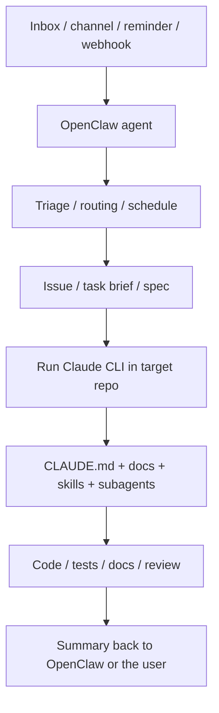

# OpenClaw + Claude CLI Integration Guide

This page answers two practical questions:

1. How should an OpenClaw agent hand work into a Claude CLI repo workflow?
2. Can MCP be shared, and if so, at what layer?

If you have not read the conceptual comparison yet, start here:

- [OpenClaw Agents vs Claude CLI Agents](OPENCLAW_AND_CLAUDE_AGENTS.md)

That page explains the layers. This one explains how to wire them together.

---

## Short answer first

### 1. OpenClaw can call Claude CLI, but the clean mental model is “hand work to a Claude CLI main session”

The stable model is not “OpenClaw directly invokes one subagent file.”
It is:

- OpenClaw receives, routes, schedules, and triages work
- OpenClaw starts a Claude CLI workflow inside the target repo
- Claude CLI then decides how to use repo context, `CLAUDE.md`, `.claude/agents/`, and `.claude/skills/`

So the call chain is closer to:

```text
OpenClaw agent
  -> enter target repo
  -> run claude -p "..."
  -> Claude CLI main session takes over
  -> Claude CLI uses repo-local skills / subagents / docs
```

### 2. MCP can share capabilities, but do not assume both systems automatically share one config file

The more precise answer is:

- **You can share the same external services and credentials**
- **You should not assume OpenClaw and Claude CLI automatically use the exact same MCP config file**

As of **March 25, 2026**, Claude Code's official scope docs describe:

- user settings: `~/.claude/settings.json`
- project settings: `.claude/settings.json`
- local personal settings: `.claude/settings.local.json`
- user subagents: `~/.claude/agents/`
- project subagents: `.claude/agents/`
- project MCP: `.mcp.json`
- user/local state and user-scope MCP-related config in `~/.claude.json`

OpenClaw has its own config surface and runtime injection layer. That means:

- the same map, mail, search, or internal API service can be connected on both sides
- but one Claude-side JSON file should not automatically be treated as the universal source of truth for OpenClaw

---

## The most natural integration pattern

The strongest pattern is:

- **OpenClaw on the outside**
- **Claude CLI on the inside**



The boundary should stay this clean:

- **OpenClaw owns**
  - where work comes from
  - when it runs
  - whether it should wake you up
  - which repo should receive it
  - where the result should go back

- **Claude CLI owns**
  - entering one repo deeply
  - understanding code and current branch state
  - using project `CLAUDE.md`
  - using repo-local skills and subagents
  - implementation, testing, review, and delivery

---

## How OpenClaw should call Claude CLI

The simplest model is to treat Claude CLI as a **repo executor**.

### Pattern A: OpenClaw uses `exec` to enter a repo and launch Claude CLI

Example:

```bash
cd /path/to/repo
claude -p "Read CLAUDE.md and docs first, then handle issue #14 and return a concise implementation summary."
```

If you need structured output, ask for it explicitly:

```bash
cd /path/to/repo
claude -p "Read CLAUDE.md and the relevant docs, then handle issue #13. At the end output only:
1. files changed
2. any manual follow-up
3. whether verification ran"
```

In this mode, OpenClaw does not need to own repo-level implementation detail.
It only needs to:

- prepare the task brief
- choose the repo
- constrain the expected output
- route the result back

### Pattern B: OpenClaw creates a bridge artifact first, then Claude CLI executes against it

This is often more reliable than throwing a one-line prompt across the boundary.

OpenClaw can first produce:

- an issue summary
- a triage report
- a spec doc
- a next-actions note

Then Claude CLI runs against that artifact:

```text
Please implement the work described in @docs/issues/issue-14.md and update the related docs.
```

Benefits:

- clearer task boundary
- easier review
- easier reruns
- cleaner separation between assistant orchestration and repo execution

---

## Where Claude CLI subagents fit in this chain

This is the piece that gets confused most often.

The stable model is:

1. OpenClaw is not operating directly on a `.claude/agents/*.md` file
2. OpenClaw hands work to the **Claude CLI main session**
3. the Claude CLI main session then decides whether to use subagents

So the real layering is:

```text
OpenClaw agent
  -> Claude CLI main session
     -> Claude CLI subagents
```

That keeps two things healthy:

- repo specialists stay defined inside the repo
- OpenClaw does not become an over-coupled “god scheduler” for every internal repo role

---

## What “sharing MCP” really means

It helps to separate sharing into three layers.

### Layer 1: sharing the same external services

This is usually fine.

Examples:

- maps
- email
- GitHub API
- internal retrieval systems

Those services can be connected to multiple systems.

### Layer 2: sharing the same credentials

Also usually fine, but it is cleaner to keep credentials in:

- environment variables
- a secret manager
- each system's supported secure config surface

Instead of scattering sensitive values across repo files.

### Layer 3: sharing the exact same config file

This is where people most often over-assume.

For Claude Code, the current official scope model is:

- user/local state and user-scope MCP-related config in `~/.claude.json`
- repo-scoped MCP server definitions in `.mcp.json`

OpenClaw maintains its own MCP config and runtime injection layer. It can manage its own MCP server definitions, and in some CLI-backend integrations it can explicitly pass MCP config into Claude CLI.

So the safer conclusion is:

- **shared services and shared credentials: yes**
- **explicit bridging of selected MCP definitions into Claude CLI runs: possible**
- **automatic universal file sharing between both systems: do not assume it**

---

## Recommended MCP strategy

### Capabilities you want everywhere

Examples:

- search
- maps
- email
- general documentation lookup

If these are primarily for Claude CLI across many repos, prefer Claude Code user scope.

### Capabilities clearly tied to one repository

Examples:

- a repo-specific database
- a repo-specific internal API
- a project-local tool that only makes sense here

Prefer the repo's `.mcp.json`.

### Capabilities OpenClaw needs as part of a long-lived assistant system

Examples:

- inbox automation
- cross-channel message handling
- OpenClaw-owned routing and background flows

Prefer OpenClaw's own config / plugin / agent-runtime side.

One-line summary:

- keep **repo-specific** capability close to the repo
- keep **assistant-specific** capability close to OpenClaw
- share the **service and credentials**, not necessarily the exact file

---

## Three workflows you can copy

### Workflow 1: OpenClaw does inbox triage, Claude CLI does repo execution

1. OpenClaw scans inbox, issues, or webhooks.
2. OpenClaw writes a structured triage result.
3. OpenClaw chooses the target repo.
4. OpenClaw launches Claude CLI in that repo.
5. Claude CLI uses local docs, skills, and subagents to implement or review the work.
6. Claude CLI returns a structured summary.
7. OpenClaw sends the result back to the original channel or memory surface.

This is the most recommended pattern.

### Workflow 2: OpenClaw only schedules and reminds; the developer manually runs Claude CLI

1. OpenClaw handles reminders, summaries, and task collection.
2. You enter the target repo manually.
3. You run Claude CLI in that repo.
4. Claude CLI uses local `CLAUDE.md`, skills, and subagents to complete the work.

Lower integration cost, still very solid.

### Workflow 3: Claude CLI only, no OpenClaw

If your real need is mostly:

- coding
- testing
- review
- maintaining one repo

Then Claude CLI alone is usually enough.
Do not add a second system only because “multi-agent” sounds attractive.

---

## Common failure modes

### Mistake 1: letting OpenClaw absorb too much deep repo implementation

That mixes long-lived assistant context with repo execution context too aggressively.

### Mistake 2: treating Claude CLI subagents like a persistent scheduler

Claude CLI subagents are specialists inside an active repo workflow, not an always-on duty system.

### Mistake 3: assuming one MCP file path should feed both systems automatically

The cleaner approach is system-local config plus explicit bridging where needed.

### Mistake 4: skipping bridge artifacts

Without issue docs, triage reports, specs, or task briefs between OpenClaw and Claude CLI, the whole setup becomes too dependent on one-off chat context and gets hard to rerun or audit.

---

## One rule of thumb

If you remember only one sentence, use this:

- **OpenClaw answers where work comes from, when it runs, and where the result should go**
- **Claude CLI answers who should do the work inside the repo, how to do it, and how to verify it**

---

## Further reading

- [OpenClaw Agents vs Claude CLI Agents](OPENCLAW_AND_CLAUDE_AGENTS.md)
- [Personal assistant / knowledge system workflow](../HOW_TO_START_ASSISTANT_SYSTEM.md)
- [Existing project workflow](../HOW_TO_START_EXISTING_PROJECT.md)
- [Claude Code settings scope docs](https://code.claude.com/docs/en/settings)
- [OpenClaw Tools and Plugins](https://docs.openclaw.ai/tools)
- [OpenClaw Subagents](https://docs.openclaw.ai/tools/subagents)
