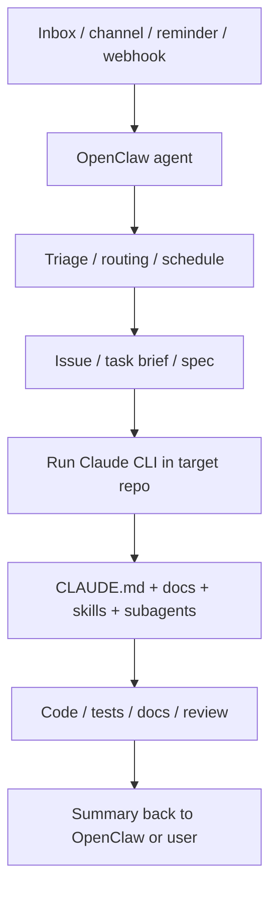

# OpenClaw 与 Claude CLI 集成实战

这篇文档专门回答两个很实际的问题：

1. OpenClaw agent 到底怎么把任务交给 Claude CLI 仓库工作流？
2. MCP 能不能共用？应该共用到什么层？

如果你还没读过概念对比，建议先看：

- [OpenClaw Agent 与 Claude CLI Agent：异同与互补](OPENCLAW_AND_CLAUDE_AGENTS_CN.md)
- [OpenClaw 与 Claude CLI 工作流场景拆分](OPENCLAW_CLAUDE_WORKFLOW_SCENARIOS_CN.md)

这篇则更偏“怎么落地”。

---

## 先给结论

### 1. OpenClaw 可以调用 Claude CLI，但更准确地说是“把任务送进 Claude CLI 主会话”

更稳的理解方式不是“OpenClaw 直接调用某个 Claude 子代理文件”，而是：

- OpenClaw 先负责接消息、定时、路由、分发
- 然后在目标仓库里启动一次 Claude CLI 工作流
- 再由 Claude CLI 主会话根据仓库上下文、`CLAUDE.md`、`.claude/agents/`、`.claude/skills/` 决定怎么做

所以真正的调用链更像：

```text
OpenClaw agent
  -> 进入目标仓库
  -> 调用 claude -p "..."
  -> Claude CLI 主会话接管
  -> Claude CLI 再使用仓库内技能 / 子代理 / 文档
```

### 2. MCP 可以“共享能力”，但不要默认理解成“所有配置文件天然共用”

更准确的说法是：

- **可以共享同一套外部服务与凭据**
- **不该默认假设 OpenClaw 和 Claude CLI 会自动读取同一份 MCP 配置文件**

截至 **2026-03-25**，Claude Code 官方文档对作用域的说明是：

- 用户级 settings：`~/.claude/settings.json`
- 项目级 settings：`.claude/settings.json`
- 本地个人 settings：`.claude/settings.local.json`
- 用户级子代理：`~/.claude/agents/`
- 项目级子代理：`.claude/agents/`
- 项目级 MCP：`.mcp.json`
- 其他用户 / 本地作用域状态与 MCP 相关配置保存在 `~/.claude.json`

OpenClaw 这边则有它自己的配置与运行时注入面。也就是说：

- **同一个 AMap / 邮件 / 搜索服务可以两边都接**
- **但通常不是“一份 Claude 的 JSON 文件直接给 OpenClaw 当唯一真相源”**

---

## 一条最推荐的集成链路

最自然的组合是：

- **OpenClaw 做外环**
- **Claude CLI 做内环**



分工最好保持成这样：

- **OpenClaw 负责**
  - 任务从哪里来
  - 什么时候跑
  - 要不要提醒
  - 要不要分发到某个仓库
  - 最终结果要回到哪个频道 / inbox / session

- **Claude CLI 负责**
  - 进入具体仓库
  - 理解当前代码和分支
  - 使用项目级 `CLAUDE.md`
  - 使用项目级 skills / subagents
  - 修改、测试、审查、交付

---

## OpenClaw 应该怎么调用 Claude CLI

最简单的方式就是把 Claude CLI 当成“仓库执行器”。

### 方式 A：由 OpenClaw 用 `exec` 工具进入仓库并启动 Claude CLI

示意命令：

```bash
cd /path/to/repo
claude -p "请先阅读 CLAUDE.md 与 docs/，再处理 issue #14，并给出最终修改说明。"
```

如果你需要结构化输出，可以再要求它：

```bash
cd /path/to/repo
claude -p "请阅读 CLAUDE.md、相关 docs，并处理 issue #13。最终只输出：
1. 修改了哪些文件
2. 还需人工确认什么
3. 测试是否已跑"
```

这种模式下，OpenClaw 不必承担仓库级实现细节；它只负责：

- 准备任务摘要
- 指定目标仓库
- 约束输出格式
- 把结果送回原渠道

### 方式 B：先由 OpenClaw 产出桥接文档，再把文档交给 Claude CLI

这通常比“直接丢一句话”更稳。

例如 OpenClaw 先产出：

- issue 摘要
- triage report
- spec 文档
- next actions 清单

然后再让 Claude CLI 在仓库里执行：

```text
请根据 @docs/issues/issue-14.md 完成修改，并更新相关文档。
```

这样好处是：

- 任务边界清楚
- 更适合审查
- 下次重跑不需要重构上下文
- OpenClaw 和 Claude CLI 的职责更稳定

---

## Claude CLI 子代理在这条链路里处于什么位置

这个问题最容易混。

在实践上，更稳的心智模型是：

1. OpenClaw 不直接面向某个 `.claude/agents/*.md` 文件工作
2. OpenClaw 是把任务交给 **Claude CLI 主会话**
3. Claude CLI 主会话再根据仓库情况决定是否调用子代理

所以分层应该理解成：

```text
OpenClaw agent
  -> Claude CLI main session
     -> Claude CLI subagents
```

这样有两个明显好处：

- 仓库内专家角色仍然留在仓库里定义
- OpenClaw 不会变成“直接遥控仓库内部每个专家”的上帝调度器

这会比强行把两套角色系统揉成一层，稳定得多。

---

## MCP 到底怎么“共用”

这里建议把“共享”分成三层看。

### 第 1 层：共享同一套外部服务

这个通常没问题。

例如：

- 高德地图
- 邮件发送
- GitHub API
- 内部检索服务

这些外部能力，本来就可以同时被多个系统接入。

### 第 2 层：共享同一套凭据

这通常也可以，但更推荐把凭据放在：

- 环境变量
- Secret manager
- OpenClaw / Claude 各自支持的安全配置入口

而不是把敏感值直接散落在多个仓库文件里。

### 第 3 层：共享同一份配置文件

这层最容易误判。

对于 Claude Code，当前应优先按官方作用域来理解：

- 用户级 / 本地状态与用户级 MCP 相关信息在 `~/.claude.json`
- 仓库级 MCP 服务器定义在 `.mcp.json`

OpenClaw 则维护自己的 MCP 配置与运行时注入面。它可以管理自己的 MCP server 定义，也可以在某些 CLI backend 场景里给 Claude CLI 显式传入 MCP 配置。

所以更稳的结论是：

- **可以共享能力与凭据**
- **可以通过显式桥接让某些 MCP server 定义进入 Claude CLI 运行**
- **但不要默认假设 OpenClaw 与 Claude Code 自动共用同一份 MCP 配置文件**

---

## 最推荐的 MCP 配置策略

### 全局常用、跨仓库都想用的能力

例如：

- 搜索
- 地图
- 邮件
- 通用文档检索

如果你主要是给 Claude CLI 用，优先放在 Claude Code 的用户级配置里。

### 明显跟某个仓库绑定的能力

例如：

- 当前仓库专属数据库
- 当前仓库专属内部 API
- 只对这个项目有意义的本地工具

优先放在这个仓库的 `.mcp.json`。

### 长期在线助理本身要独立使用的能力

例如：

- inbox 自动化
- 跨渠道消息处理
- OpenClaw 自己的路由与后台流程

优先放在 OpenClaw 自己的配置 / 插件 / agent runtime 侧。

一句话总结：

- **Repo-specific 的能力贴近仓库放**
- **Assistant-specific 的能力贴近 OpenClaw 放**
- **共享的是服务与凭据，不一定是文件本身**

---

## 三条可以直接照抄的工作流

### 工作流 1：OpenClaw 做 inbox triage，Claude CLI 做 repo executor

1. OpenClaw 扫描 inbox / issue / webhook。
2. OpenClaw 输出一份结构化 triage 结果。
3. OpenClaw 决定这条任务属于哪个仓库。
4. OpenClaw 在该仓库启动 Claude CLI。
5. Claude CLI 调用本仓库技能、子代理、文档，完成实现或审查。
6. Claude CLI 输出结果摘要给 OpenClaw。
7. OpenClaw 再把结果发回原渠道或记入长期记忆。

这是最推荐的模式。

### 工作流 2：OpenClaw 只做提醒和调度，开发者手动进入仓库跑 Claude CLI

1. OpenClaw 负责提醒、汇总、生成任务列表。
2. 你手动进入目标仓库。
3. 你在仓库里运行 Claude CLI。
4. Claude CLI 使用本地 `CLAUDE.md`、技能、子代理完成工作。

这种模式实现成本更低，也很稳。

### 工作流 3：只让 Claude CLI 处理仓库，不把 OpenClaw 拉进来

如果你的核心诉求只是：

- 写代码
- 跑测试
- 做审查
- 维护单个仓库

那直接只用 Claude CLI 即可，不必为了“多 agent”而多加一层系统。

---

## 最容易踩的坑

### 坑 1：让 OpenClaw 直接承担太多仓库深度实现

这样很容易把长期助理系统的上下文和单仓库实现上下文搅在一起。

### 坑 2：把 Claude CLI 子代理当作长期调度器

Claude CLI 子代理适合“当前仓库里的专项分工”，不适合承担长期在线和值班调度。

### 坑 3：以为“一套 MCP 文件路径”能天然喂给两个系统

当前更稳的做法是按系统边界配置，再显式桥接，不要隐式耦合。

### 坑 4：没有中间桥接产物

如果 OpenClaw 和 Claude CLI 之间没有 issue doc、triage report、spec、任务摘要这一层，系统会越来越依赖一次性对话上下文，后面会很难重跑和审查。

---

## 一句经验法则

如果你只记一句话，记这个：

- **OpenClaw 负责“任务从哪来、什么时候跑、结果回哪去”**
- **Claude CLI 负责“进入当前仓库后，谁来做、怎么做、怎么验”**

---

## 延伸阅读

- [OpenClaw Agent 与 Claude CLI Agent：异同与互补](OPENCLAW_AND_CLAUDE_AGENTS_CN.md)
- [个人助理 / 知识系统工作流](../HOW_TO_START_ASSISTANT_SYSTEM_CN.md)
- [现有项目工作流](../HOW_TO_START_EXISTING_PROJECT_CN.md)
- [Claude Code settings 作用域说明](https://code.claude.com/docs/en/settings)
- [OpenClaw Tools and Plugins](https://docs.openclaw.ai/tools)
- [OpenClaw Subagents](https://docs.openclaw.ai/tools/subagents)
